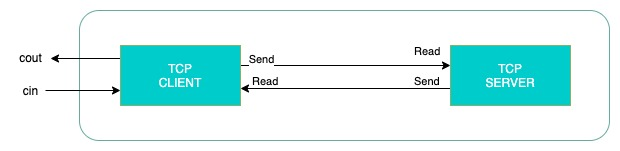

### Server implementation written in c++ from scratch

### local environment 

install cmake to build the project
```s
brew install cmake
```

run cmake build from ./build folder, it will create two executable binaries: server and client
```s
mkdir build
cd build
cmake ..
cmake --build .
```
then run from terminal
```s
./src/server/server
```

from other terminal run
```s
./src/client/client
```

Unit tests (with Google Test) example (TODO: need more configuration)
from project dir

```
git clone https://github.com/google/googletest/
./tests/test_hello
```

### Resources:
1. <a href="https://medium.com/from-the-scratch/http-server-what-do-you-need-to-know-to-build-a-simple-http-server-from-scratch-d1ef8945e4fa">HTTP Server: Everything you need to know to Build a simple HTTP server from scratch</a>
2. Beej's Guide to Network Programming. Using Internet Sockets https://beej.us/guide/bgnet/


### Steps:
1. Created simple echo server. All the code in separate folder achived. It is possible to run them with c++ commands. In order to see response from browser run server and open: http://localhost:8081/


2. Extracted server socket into the own class -> serverSocker.h, serverSocket.cpp, main.cpp and placed to folder server.

3. Extracting client socket into the own class -> clientSocker.h, clientSocket.cpp, main.cpp and placed to folder client.

4. Adapted CMakeLists.txt files for current implementation.

so the echo implementation of server as follows

